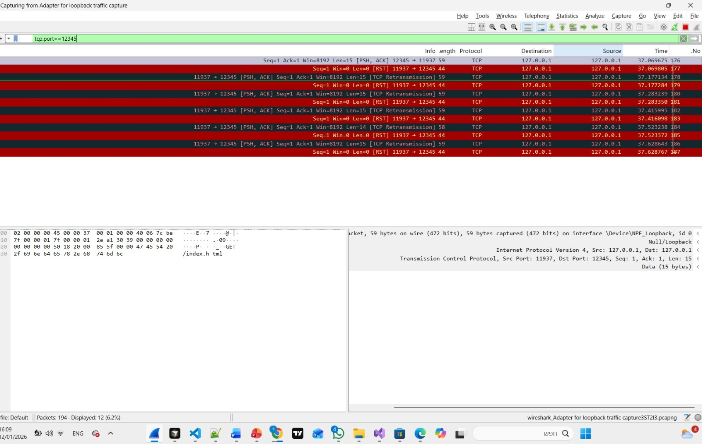
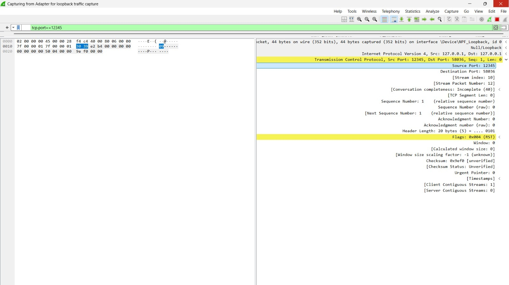

# חלק 1

**מגישים:** סוורי דור  212541783 , אוחיון נטף 322739889, פרוחורוב דניאל 211535935
**תאריך:** 11.01.2026  
**קישור ל-GITHUB:**  https://github.com/DorSwery11/net_project-1


---

## יצירת קובץ ה-CSV

לצורך ביצוע הפרויקט, יצרנו קובץ נתונים בשם group212541783_http_input.csv.

• **אופן יצירת הקובץ:** השתמשנו ב CHATGPT כדי ליצור את ההודעות.

• **מבנה הקובץ:** הקובץ מכיל את השדות הבאים:
  - `msg_id` - מזהה ייחודי לכל הודעה
  - `app_protocol` - פרוטוקול שכבת האפליקציה (HTTP)
  - `src_app` - מקור ההודעה (client_browser)
  - `dst_app` - יעד ההודעה (web_server)
  - `message` - תוכן ההודעה (למשל: GET /index.html)
  - `timestamp` - חותם זמן של ההודעה

שדות אלו משמשים כבסיס לסימולציית המידע שעובר ברשת.

**תוכן הקובץ:**
```
msg_id,app_protocol,src_app,dst_app,message,timestamp
1,HTTP,client_browser,web_server,GET /index.html,0.01
2,HTTP,web_server,client_browser,HTTP/1.1 200 OK,0.02
3,HTTP,client_browser,web_server,GET /about.html,0.05
4,HTTP,web_server,client_browser,HTTP/1.1 200 OK,0.06
5,HTTP,client_browser,web_server,GET /api/users,0.10
6,HTTP,web_server,client_browser,HTTP/1.1 200 OK,0.11
```

---

## תהליך הרצת ה-Jupyter

בשלב זה השתמשנו במחברת (`jupyter_notebook.ipynb`) כדי לדמות את תהליך אריזת הנתונים כפי שמתרחש במודל ה-TCP/IP.

תהליך ה-Encapsulation הקורה בקוד במחברת לא רק "שולח" את ההודעה, אלא מדמה את תהליך ההוספה של Headers בכל שכבה, בדומה למערכת הפעלה אמיתית:

**Headers** - הם מידע טכני שמודבק לתחילת ההודעה כדי שהמחשבים ידעו איך לטפל בה.

תהליך זה מדמה התנהגות של Client המייצר תעבורה, אותה אנו רואים לאחר מכן נלכדת בכלי ה-Wireshark.

### שלבי ה-Encapsulation:

1. **שכבת היישום (Application Layer)**
   - הקוד לוקח את ה-Message מה-CSV (למשל: "GET /index.html") ומוסיף לו כותרות של פרוטוקול HTTP.
   - בשלב זה ההודעה מוכנה להיות מועברת בשכבת האפליקציה.

2. **שכבת התעבורה (Transport Layer - TCP)**
   - המידע נעטף ב-TCP Header.
   - בשלב זה מוגדרים:
     - `Src_port` - פורט המקור (מספר אקראי בין 1024-65535)
     - `Dst_port` - פורט היעד (12345)
     - דגלים ראשוניים (Flags) - כגון SYN, ACK, PSH
     - Sequence Number ו-Acknowledgment Number
     - Window Size

3. **שכבת הרשת (Network Layer - IP)**
   - החבילה מקבלת IP Header עם:
     - כתובת IP מקור: `127.0.0.1` (Loopback)
     - כתובת IP יעד: `127.0.0.1` (Loopback)
     - TTL (Time To Live): 64
     - Protocol: TCP (6)
     - Header Checksum

4. **שכבת הקישור (Link Layer)**
   - החבילה מוכנה לשליחה ברשת המקומית.

בסיום ה-Encapsulation הסקריפט שולח את החבילה המוכנה לרשת, שם קולטים אותה ב-Wireshark.

---

## תהליך הלכידה ב-Wireshark

כדי ללכוד את התעבורה שנוצרה על ידי הסקריפט, ביצענו את הפעולות הבאות ב-Wireshark:

1. **פתיחת Wireshark ובחירת ממשק רשת:**
   - פתחנו את תוכנת Wireshark ובחרנו בממשק הרשת **Npcap Loopback Adapter** (או "Adapter for loopback traffic capture").
   - בחירה זו נדרשת מאחר והתקשורת היא מקומית בין תהליכים באותו מחשב (127.0.0.1).

2. **הגדרת מסנן תצוגה:**
   - הפעלנו מסנן תצוגה: `tcp.port == 12345`
   - מטרת המסנן היא לבודד רק את התעבורה הקשורה לפרויקט ולהתעלם מרעשי רקע של המחשב.

3. **הרצת הסקריפט:**
   - הרצנו את הסקריפט במחברת Jupyter.
   - צפינו בתעבורה בזמן אמת ב-Wireshark.

4. **שמירת הלכידה:**
   - עצרנו את הלכידה ושמרנו את התוצאה בקובץ `.pcap`.

---

## ניתוח התעבורה ב-Wireshark

### צילום מסך 1: לכידה בWireshark


**ניתוח:**
בצילום המסך המצורף ניתן לראות תיעוד של תעבורת TCP על גבי Loopback(כלומר תקשורת פנימית בתוך המחשב עצמו) באמצעות Wireshark, כאשר מופעל פילטר: 
tcp.port == 12345
מה שאומר שמוצגים רק פאקטות שקשורים לפורט 12345.
בצילום המסך רואים ניסיון של לקוח(Client) לשלוח בקשת HTTP לשרת מקומי דרך כתובת:
127.0.0.1 <- 127.0.0.1

• **Source Port:** 11937 - הלקוח שמנסה להתחבר - הסקריפט שאנחנו מריצים  
• **Destination Port:** 12345 - השרת אליו מנסים לפנות  
• **SYN** –  דגל המבקש להתחיל חיבור TCP חדש  .  
• **ACK** – אישור שההתחברות הראשונית מהצד השני התבצעה ועד לרגע זה החיבור תקין.  
• **PSH** –  דגל המסמן שיש מידע שצריך להעביר מיד לשכבת האפליקציה (כאן: בקשת HTTP).  
• **RST** = RESET - דגל המסמן ניתוק מידי של הקשר. ה-RST מעיד על תקלה או על כך שהצד השני אינו פעיל.  
• **WIN** - מנגנון בקרת זרימה המודיע לשולח כמה מקום פנוי יש למקבל.

---


#### הסבר על הצבעים והדגלים שנלכדו:
א. שורות עם רקע אפור וטקסט לבן:  
שורות אלו מייצגות את הניסיון של הלקוח לשלוח מידע לשרת (בקשת תקשורת).

• **SEQ = 1** - מציין את מספר הרצף של הבייט הראשון שנשלח בזרם הנתונים. זה מעיד שהחיבור כבר החל והלקוח שולח מידע החל מהבית הראשון של המקטע הנוכחי.  
• **LEN > 0** - בשורות אלו יש תוכן אמיתי (Payload). כפי שניתן לראות ב-Payload, ההודעה שנשלחת היא "GET /index.html".  
• המשמעות: הלקוח (Source Port 11937) שולח בקשת HTTP לשרת (Destination Port 12345) על גבי 127.0.0.1. בנוסף מופיע TCP Retransmission שמעיד שהלקוח מנסה לשדר את ההודעה שוב מאחר ולא התקבלה תגובה תקינה מהצד השני.

ב. שורות עם רקע אדום (RST):  
אלו הן תשובות מהצד השני (השרת / מערכת ההפעלה בצד פורט 12345) שמודיעות על ניתוק מיידי של החיבור.

• **RST,ACK:** RST הוא דגל Reset שמסמן שהחיבור נסגר באופן מיידי (לרוב בגלל שאין שירות שמאזין בפורט או שהחיבור נדחה). ACK משמש כאישור לקבלת המידע עד אותו שלב בתקשורת.  
• **WIN=0:** מציין חלון בגודל 0, כלומר הצד השני לא מאפשר המשך העברת נתונים והתקשורת נעצרת.  
• **LEN = 0:** חבילה זו אינה מכילה תוכן משכבת האפליקציה, אלא משמשת כתגובה טכנית בלבד לצורך סגירת החיבור.
### צילום מסך 3: ניתוח מבנה החבילה (Packet Details)


**ניתוח:**
בבחינת חלונית הפרטים, ניתן לראות את חלוקת המידע לשכבות הפרוטוקול:

#### שכבת ה-IP (Internet Protocol):

• **Version:** 4 - גרסת פרוטוקול IP  
• **Header Length:** 20 bytes - אורך כותרת IP  
• **Time to Live (TTL):** הערך הוא 64. זהו ערך סטנדרטי המעיד שהחבילה לא עברה דרך ראוטרים, מה שמאשש שמדובר בתעבורה פנימית (Localhost).  
• **Protocol:** TCP (6)  
• **Source IP:** 127.0.0.1  
• **Destination IP:** 127.0.0.1  
• **Header Checksum:** מופיע כ-Unverified. זהו מצב תקין ולא שגיאה; מערכת ההפעלה מעבירה את חישוב "ספרת הביקורת" לכרטיס הרשת (Offloading) כדי לחסוך במשאבים, ולכן Wireshark (שלוכד את המידע לפני כן) לא רואה את הערך הסופי.

#### שכבת התעבורה (TCP):

• **Source Port:** 12345 - פורט המקור  
• **Destination Port:** 12345 - פורט היעד  
• **Sequence Number:** 1 - מספר רצף של הנתונים  
• **Acknowledgment Number:** 0 - אישור קבלה  
• **Header Length:** 20 bytes  
• **Flags:** RST  
• **Window Size:** 0 - גודל חלון הזרימה  
• **Len (Length):** מציין את אורך המידע נטו (Payload) שנשלח בחבילה זו (0 בתים).

## סיכום האירועים

### סיכום כללי:

1. **יצרנו קובץ CSV עם הודעות HTTP בשכבת האפליקציה:**
   - הסקריפט קורא את ההודעות מקובץ ה-CSV (`group212541783_322739889_http_input.csv`).
   - כל הודעה עוברת תהליך Encapsulation מלא דרך שכבות TCP/IP.

1. **הרצנו מחברת Jupyter המדמה תהליך Encapsulation מלא של חבילות TCP/IP:**
   - כל הודעה הופכת לחבילה (Packet) עם Headers של IP ו-TCP.
   - החבילות נשלחות ליעד 127.0.0.1:12345.

1. **לכדנו ב-Wireshark:**
   - Wireshark לוכד את כל החבילות הנשלחות.
   - ניתן לראות את המבנה המלא של כל שכבה.

1. **ניתוח החבילות שנלכדו והסבר תהליך התקשורת:**
   - מאחר ואין שרת אמיתי שמאזין בפורט 12345, מערכת ההפעלה מחזירה הודעות RST.
   - הלקוח מנסה לבצע Retransmission - שידור חוזר של המידע.
   


		הפרויקט הדגים בצורה מעשית את תהליך אריזת הנתונים בשכבות TCP/IP ואת האופן שבו מידע עובר ברשת מחשבים.

---

## נספחים

### נספח א': קובץ CSV המלא
קובץ group212541783_http_input.csv ב git

### נספח ב':  מחברת Jupyter 
קובץ jupyter_notebook.ipynb ב git

### נספח ג': קובץ pcap מ Wireshark
קובץ wireshark_pcap1.pcap ב git
*על מנת לראות את הלכידה יש לפלטר עם tcp.port==12345

---
