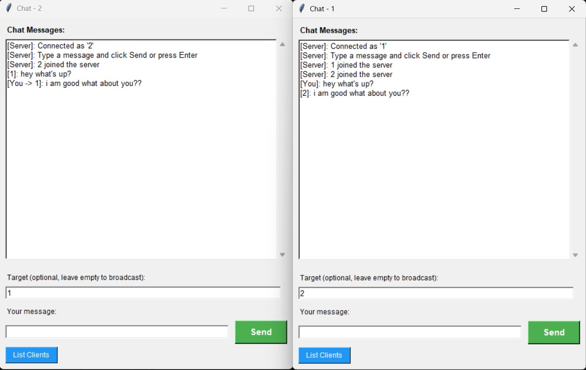

# דוח מסכם: פרויקט תקשורת מחשבים - חלק 2
## יישום רשת וניתוח תעבורה

**מגישים:** סוורי דור 212541783,  אוחיון נטף 322739889, פרוחורוב דניאל 211535935  
**תאריך:** 11.01.2026 
**קישור ל-GitHub:**  https://github.com/DorSwery11/net_project-1

---

## 1. הסבר כללי על המערכת ומבנה הקוד

פיתחנו מערכת צ'אט מבוססת TCP בשם "Chat Application" שעובדת בארכיטקטורת Client-Server. המערכת מאפשרת למספר משתמשים להתחבר במקביל, לשלוח הודעות לכולם (Broadcast) או הודעות פרטיות ללקוח ספציפי לפי שם.

### רכיבי המערכת

**א. צד השרת - chat_server.py**

השרת הוא הלב של המערכת ואחראי על ניהול החיבורים והעברת ההודעות.

**תקשורת (Sockets):**
השרת מאזין בפורט 9999 על כתובת localhost (127.0.0.1) ומקבל חיבורים מלקוחות באמצעות פרוטוקול TCP.

**ריבוי תהליכונים (Multi-Threading):**
כדי לתמוך בהרבה לקוחות במקביל (לפחות 5 כנדרש, בפועל יותר), השרת יוצר Thread נפרד לכל לקוח שמתחבר. כך השרת תמיד פנוי לקבל חיבורים חדשים בזמן שהוא מטפל באחרים.

**ניהול משתמשים:**
המערכת שומרת מילון (Dictionary) של כל המשתמשים המחוברים, כאשר המפתח הוא שם המשתמש והערך הוא ה-Socket שלו. כי יש הרבה Threads שניגשים לאותו מילון, השתמשנו ב-Lock (threading.Lock) למניעת התנגשויות (Race Conditions).

**פרוטוקול האפליקציה:**
- **התחברות:** לקוח שולח `REGISTER:client_name`, השרת בודק שהשם לא תפוס ומחזיר `REGISTERED` או `ERROR:Name already taken`
- **הודעות פרטיות:** לקוח שולח `CHAT:target_name:message_content`, השרת מעביר את ההודעה רק ללקוח המבוקש
- **הודעות לכולם:** לקוח שולח `BROADCAST:message_content`, השרת מעביר את ההודעה לכל הלקוחות המחוברים (חוץ מהשולח)
- **רשימת לקוחות:** לקוח שולח `LIST`, השרת מחזיר `CLIENT_LIST:name1,name2,...`
- **עדכון רשימה:** כשמישהו מתחבר או מתנתק, כל הלקוחות מקבלים הודעת סטטוס `STATUS:message`

**טיפול בשגיאות:**
השרת מטפל בניתוקים לא צפויים של לקוחות באמצעות try-except blocks, ומנקה את רשימת הלקוחות כשמישהו מתנתק.

**ב. צד הלקוח - chat_client.py ו-chat_client_gui.py**

המערכת מספקת שני ממשקים: טקסטואלי (CLI) וגרפי (GUI).

**ממשק טקסטואלי (chat_client.py):**
ממשק פשוט לשורת פקודה שמאפשר:
- הקלדת הודעה ישירה → נשלחת לכולם (Broadcast)
- פקודה send *name* → הודעה פרטית ללקוח ספציפי
- פקודה `list` → רשימת הלקוחות המחוברים
- פקודה `quit` → התנתקות

**ממשק גרפי (chat_client_gui.py):**
ממשק גרפי נוח בנוי עם Tkinter שמכיל:
- חלון צ'אט עם אזור תצוגה (ScrolledText) שמציג את כל ההודעות
- שדה "Target" אופציונלי - אם ריק, ההודעה נשלחת לכולם; אם ממלאים שם, ההודעה פרטית
- שדה הודעה להקלדת הטקסט
- כפתור "Send" ירוק לשליחת ההודעה (או Enter)
- כפתור "List Clients" כחול לראות מי מחובר

**תקשורת אסינכרונית:**
כדי שהממשק לא יקפא בזמן שמחכים להודעות, יש Thread נפרד שמאזין כל הזמן לשרת ומעדכן את המסך מיד כשמגיעה הודעה חדשה. ב-GUI, העדכונים נעשים דרך `root.after()` כדי לעדכן את הממשק מהת'רד הראשי.

---

## 2. מבנה הקוד

חילקנו את הקוד ל-3 קבצים עיקריים:

| קובץ | תפקיד |
|------|-------|
| `chat_server.py` | השרת - מטפל בחיבורים, ניהול לקוחות, והעברת הודעות (פרטיות ו-Broadcast) |
| `chat_client.py` | הלקוח הטקסטואלי - ממשק שורת פקודה לתקשורת עם השרת |
| `chat_client_gui.py` | הלקוח הגרפי - ממשק GUI עם Tkinter לתקשורת עם השרת |

**מחלקות עיקריות:**
- `ChatServer` - מחלקת השרת עם מתודות לניהול לקוחות והודעות
- `ChatClient` - מחלקת הלקוח הטקסטואלי
- `ChatClientGUI` - מחלקת הלקוח הגרפי

---

## 3. הוראות התקנה והרצה

**דרישות:** Python 3.x (ללא ספריות חיצוניות - רק ספריות סטנדרטיות: socket, threading, tkinter)

**הפעלת השרת:**
```bash
python chat_server.py
```
השרת יתחיל להאזין על `localhost:9999` ויציג:
```
Server started on localhost:9999
Waiting for clients to connect...
```

**הפעלת לקוחות (טקסטואלי):**
```bash
python chat_client.py <client_name>
```
לדוגמה:
```bash
python chat_client.py Dor
python chat_client.py Nataf
```

**הפעלת לקוחות (GUI):**
```bash
python chat_client_gui.py <client_name>
```
לדוגמה:
```bash
python chat_client_gui.py Dor
python chat_client_gui.py Nataf
```
פותחים כמה חלונות, כל אחד עם שם משתמש אחר.

---

## 4. דוגמאות קלט ופלט

### ממשק המערכת בזמן פעולה


**ממשק GUI:**
החלון מכיל:
- אזור צ'אט גדול שמציג את כל ההודעות עם שם השולח
- שדה "Target" (אופציונלי) - להזנת שם לקוח להודעה פרטית
- שדה "Your message" - להקלדת ההודעה
- כפתור "Send" ירוק
- כפתור "List Clients" כחול

### תהליך שליחת הודעה

**1. הודעה לכולם (Broadcast):**
- **קלט:** המשתמש מקליד הודעה (בלי למלא Target ב-GUI, או פשוט להקליד ב-CLI)
- **עיבוד:** הלקוח שולח `BROADCAST:message` לשרת, השרת מפיץ לכל המחוברים
- **פלט:** ההודעה מופיעה מיד אצל כל הלקוחות המחוברים

**2. הודעה פרטית:**
- **קלט:** המשתמש מקליד `send Bob Hello` ב-CLI, או ממלא Target=Dor ו-message=Hello ב-GUI
- **עיבוד:** הלקוח שולח `CHAT:Bob:Hello` לשרת, השרת מעביר רק ל-Dor
- **פלט:** ההודעה מופיעה רק אצל Dor (ולא אצל אחרים)

**בדיקת מקרה קצה:**
---במקרה שמשתמש רוצה להשתמש בשם שתפוס כבר תעלה השגיאה הבאה:
![[screen-shot-3.jpeg]]
## 5. ניתוח תעבורה של היישום (Wireshark)


לכדנו את התעבורה עם Wireshark בממשק Loopback ושמרנו בקובץ `chat_traffic.pcap`.
![[screen-shot-5.jpeg]]
בתמונה הבאה ניתן לראות מצד שמאל את תוכן ההודעה שנשלחה ובכך אנו בטוחים שלכדנו את ההודעה הנכונה: ![[screen-shot-6.jpeg]]
### התעבורה שנלכדה

**התקשורת:**
- Server Port: 9999
- Client Ports: דינמיים (למשל 54321, 54322)
- כתובות: 127.0.0.1 ↔ 127.0.0.1 (תקשורת מקומית)

### א. שכבת הרשת (Network Layer - IP)

כל התקשורת בין 127.0.0.1 ל-127.0.0.1 - הכל מקומי על אותו מחשב (Loopback).

### ב. שכבת התעבורה (Transport Layer - TCP)

בחרנו ב-TCP כי הוא אמין - מבטיח שההודעות יגיעו בסדר הנכון ובשלמותן. חשוב לצ'אט.

**הקמת חיבור (Three-Way Handshake):**
1. **SYN** - הלקוח מבקש להתחבר לשרת
2. **SYN,ACK** - השרת מאשר ומציע חיבור
3. **ACK** - הלקוח מאשר, החיבור פתוח

**העברת נתונים:**

יש שני סוגי חבילות:

**חבילות עם מידע [PSH, ACK]:**
- Len > 0 (יש תוכן)
- אלה ההודעות האמיתיות של הצ'אט
- לדוגמה: `REGISTER:Alice`, `BROADCAST:Hello everyone!`, `CHAT:Bob:Hi!`

**חבילות אישור [ACK]:**
- Len = 0 (ריקות)
- רק אישור ש"קיבלתי את מה ששלחת"
- חלק מהפרוטוקול TCP

### ג. חילוץ תוכן ההודעה

בתחתית המסך ב-Wireshark רואים את ה-Payload בפורמט Hex ו-ASCII:

לדוגמה, הודעה `BROADCAST:Hello` תראה:
```
Data: 42524f4144434153543a48656c6c6f
ASCII: "BROADCAST:Hello"
```

### ד. פרטים טכניים מחבילה

Packet size: 65 bytes (520 bits)
Acknowledgment number: 28
Data length: 20 bytes
Destination port: 9999 (server)
Frame number: 42
Sequence number: 15
Source port: 54321 (client)
Window size: 65535

---

## 6. תיאור שימוש בבינה מלאכותית

השתמשנו ב-ChatGPT במהלך הפיתוח:

**מטרות השימוש:**
- יצירת מבנה בסיסי של שרת TCP עם תמיכה ב-multi-threading
- עיצוב הממשק הגרפי עם Tkinter
- הבנת פרוטוקולי TCP ודגלים ב-Wireshark
- כתיבת תיעוד והערות בקוד
- טיפול בשגיאות וניקוי משאבים
- יישום דרישות הפרויקט (תקשורת דו-כיוונית, הודעות פרטיות לפי שם)

**דוגמאות לפרומפטים:**
- "Build a TCP-based chat server that supports multiple clients using threads"
- "Create a basic GUI for a chat client, including a text input and a green Send button"
- "Add support for both broadcast messages and private messages between clients"
- "Explain the meaning of TCP flags and interpret PSH, ACK packets in Wireshark"
- "Describe ways to avoid race conditions when several threads share a dictionary"
- "Modify the chat system so the server can initiate a private chat between two clients based on their names"


---

## 7. תוצרים להגשה

**קבצי קוד:**
- `chat_server.py` -צד שרת
- `chat_client.py` - צד לקוח טקסטואלי
- `chat_client_gui.py` -צד לקוח עם ממש גרפי (GUI)

**קבצי לכידה:**
- `wireshark_pcap2.pcap` - תעבורת הצ'אט מ-Wireshark
על מנת לראות את הלכידה הנכונה יש לפלטר עם tcp.port==9999&&tcp.len>0


---


